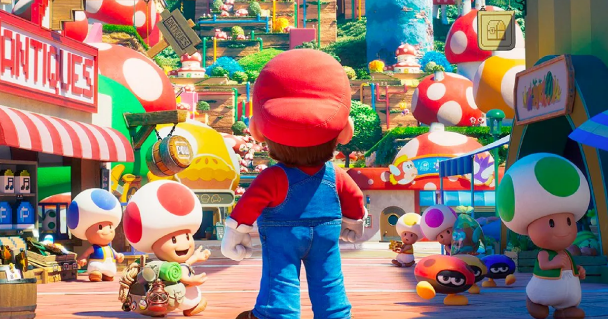

<h1 align="center"> Super Mario Bros - O Filme</h1>

Esta landing page foi desenvolvida através dos ensinamentos do Dev em Dobro com o intuito de aprender sobre HTML, CSS e JavaScript.  

 

  

## Tecnologias

Este projeto foi desenvolvido com as seguintes tecnologias:

- HTML 
- CSS
- JavaScript

## Projeto

Este projeto foi desenvolvido através dos ensinamentos divulgados nas lives do canal Dev em Dobro, o projeto é uma landing page tematizada para o lançamento do filme do Super Mario. Este projeto foi essencial para aprender a desenvolver com JavaScript utilizando funções que realizam modificações na página, além disso, adquiri novos aprendizados em HTML e CSS através do desenvolvimento deste projeto e pude fazer minhas próprias alterações com o conhecimento adquirido.

- [Clique aqui para visualizar o projeto online](https://arthur-gabriel-silva2003.github.io/super-mario/)

